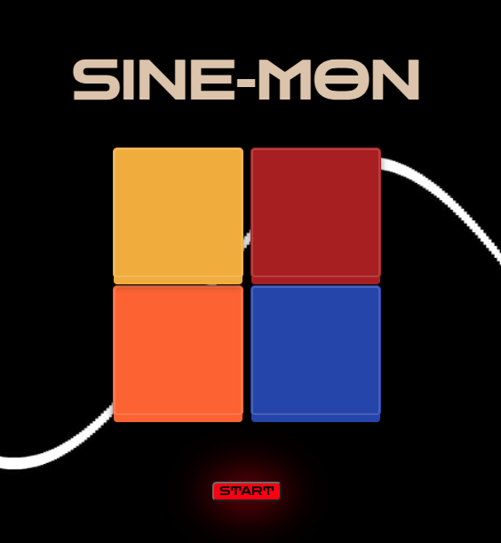
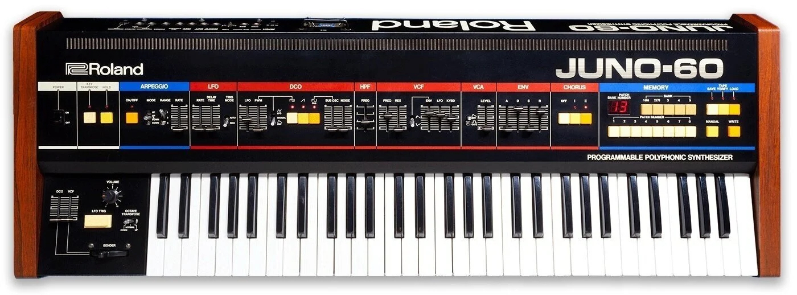

   <title>SINE-MON</title>

# What is SINE-MON?

SINE-MON is an iteration of the classic game "Simon". The goal of Simon is to repeat a series of colors and sounds that the game presents to you for as long as you can. The game becomes progressively more difficult as you successfully complete each level.I hope you enjoy this take on Simon!

# Inspiration

I've been dabbiling using synthesizers and picked up one recently that's a modern copy of one of my favorite sounding vintage synthesizers, the Juno-60. The overall look of the game is based on the aesthetic of the Juno-60. For this project I wanted to implement a sample of it's tones. I partially modified a SINE wave tone on my synth and used it for the button tones as well as the arpeggiated intro song. 

# Technologies Used

# Getting Started

Link to live build: https://btlenny.github.io/Simon/

1. Begin by clicking start
2. After the intro music has played the computer will select it's first tile and "Level: 1 of 14" will appear.
3. The player must select the same tile that the computer selects in order to continue
4. The computer will then add an additional tile to it's sequence and continue up to a pattern of 14 random tiles that the player must mimic in order to win the game.
5. If you lose or win, you can replay again by hitting start

# Next Steps

- If a player clicks to quickly it will say you lost. I will update so that even the fastest players won't have issue
- Adding in a volume button 
- Adding a button that let's play choose the difficulty of the game, rather then always going to 14
- Potentially add something a bit more fun for a rin message. Maybe a song or a graphic
